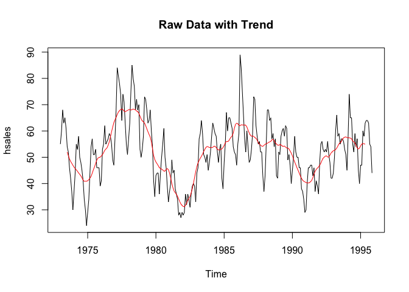
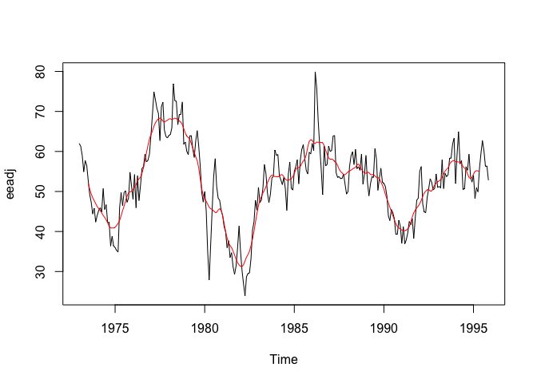
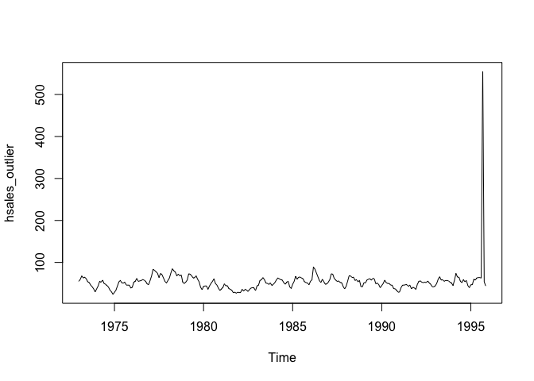
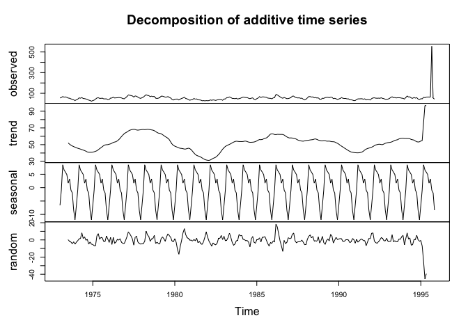
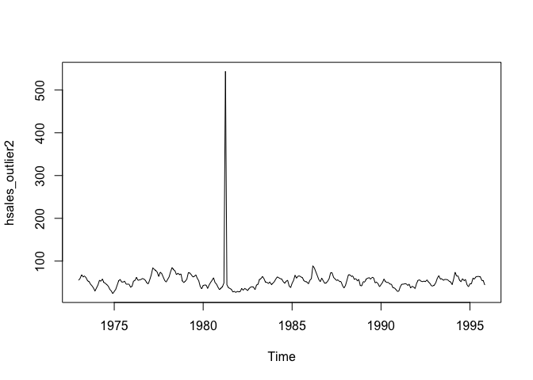
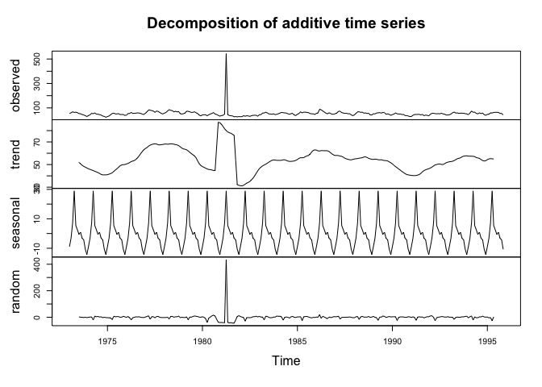
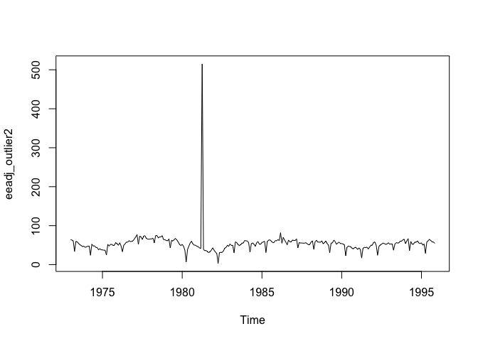
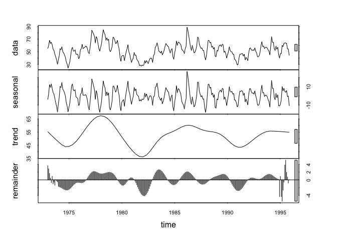
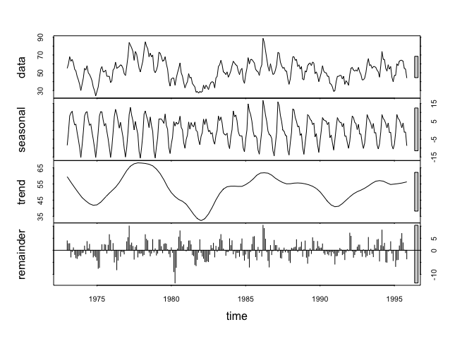
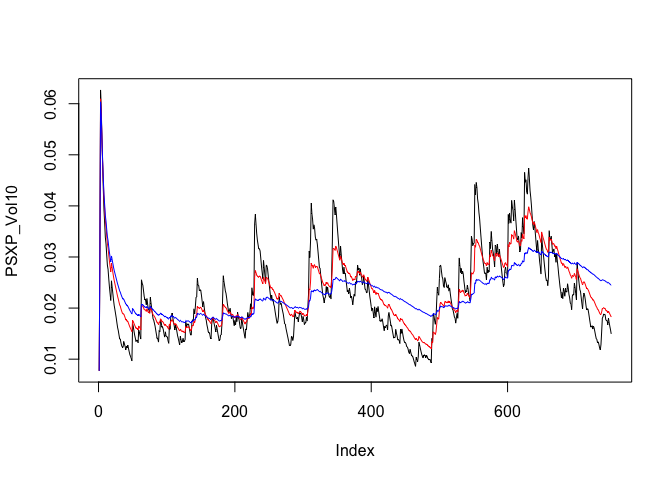

# Live Session 9 Assignment
Oscar Padilla  
July 18, 2016  


# 1) Electric Equipment Example

## Plot *hsales*


```r
data(hsales)
plot(hsales)
```

<!-- -->

This particular time series spans over 20 years (1973 - 1995) of monthly data. Just by looking at the numerical data or the standard plot, we can only identify peaks (high 80s) and valleys (mid 20's). It's not intuitive to determine a positive or negative trend due to the high data volatility.

## Classical Decomposition


```r
fitd <- decompose(hsales)
plot(fitd)
```

<!-- -->

```r
plot(hsales, col="black", main="Raw Data with Trend")
lines(fitd$trend, col="red", ylab="Trend")
```

<!-- -->

The *decompose* function makes the trend a lot more visible. Now it's apparent the high level of sales in the late 70's and a vast decrease in the mid 80's which appears again in the early 90's. The (monthly) seasonal index seems to have a span of 15 points (from -10 to +5). What is left is the random noise which has a -10 to +10 weight on the analyzed data. This decomposition present a much better interpretation of the raw data.

## Seasonally Adjusted Data


```r
eeadj <- seasadj(fitd)
plot(eeadj)
lines(fitd$trend, col="red", ylab="Trend")
```

<!-- -->

## Outlier Introduction


```r
hsales_outlier <- ts(c(hsales[1:272],hsales[273]+500,hsales[274:275]),start=c(1973,1),frequency=12)
plot(hsales_outlier)
```

<!-- -->

```r
fitd_outlier <- decompose(hsales_outlier)
plot(fitd_outlier)
```

<!-- -->

```r
eeadj_outlier <- seasadj(fitd_outlier)
plot (eeadj_outlier)
```

<!-- -->

The effect of the outlier is that it completely biases the trend and the seasonally adjusted data is unable to adequately adjust to the disproportional increase artificially added on the Sep-1995 figure.


```r
hsales_outlier2 <- ts(c(hsales[1:99],hsales[100]+500,hsales[101:275]),start=c(1973,1),frequency=12)
plot(hsales_outlier2)
```

<!-- -->

```r
fitd_outlier2 <- decompose(hsales_outlier2)
plot(fitd_outlier2)
```

<!-- -->

```r
eeadj_outlier2 <- seasadj(fitd_outlier2)
plot (eeadj_outlier2)
```

<!-- -->

When the outlier is introduced in the middle of the time series, the decomposition model seems to adapt slightly better. It not only affects the trend but also disturbs the monthly seasonal index. The random factor accounts for 400 points of the variation when the outlier is introduced in the middle as opposed to -40 when the outlier lies on the far end.

## STL to Decompose the Series


```r
fit_3 <- stl(hsales, s.window = 3)
plot(fit_3)
```

<!-- -->

```r
fit_6 <- stl(hsales, s.window = 6)
plot(fit_6)
```

<!-- -->

```r
fit_12 <- stl(hsales, s.window = 12)
plot(fit_12)
```

<!-- -->

By trying 3 different values for the *s.window* (the span of the loess window for seasonal extraction) we can appreciate that the lowest value (3), yields the lowest *remainder* range (-4 to 4) as opposed to the highest value (12) (range = -15 ... +15).

# 2) Analyze PSXP Volatility


```r
# Download historical closing prices
PSXP <- get.hist.quote('PSXP',quote="Close")
```

```
## time series starts 2013-07-23
```

```r
# Calculate log returns
PSXP_returns <- log(lag(PSXP)) - log(PSXP)
# Calculate volatility measure
PSXP_vol <-  sd(PSXP_returns) * sqrt(250) * 100
```

## Function to Calculate Volatility Measure with a Continuous Lookback Window


```r
Vol <- function(d, logrets) {
	var = 0
	lam = 0
	varlist <- c()
	for (r in logrets) {
		lam = lam*(1 - 1/d) + 1
		var = (1 - 1/lam)*var + (1/lam)*r^2
		varlist <- c(varlist, var)
	}
	sqrt(varlist)
}
```

## PSXP Volatility  with Overlay (10, 30, 100)


```r
PSXP_Vol10 <- Vol(10,PSXP_returns)
PSXP_Vol30 <- Vol(30,PSXP_returns)
PSXP_Vol100 <- Vol(100,PSXP_returns)
plot(PSXP_Vol10,type="l")
lines(PSXP_Vol30,type="l",col="red")
lines(PSXP_Vol100, type = "l", col="blue")
```

<!-- -->

